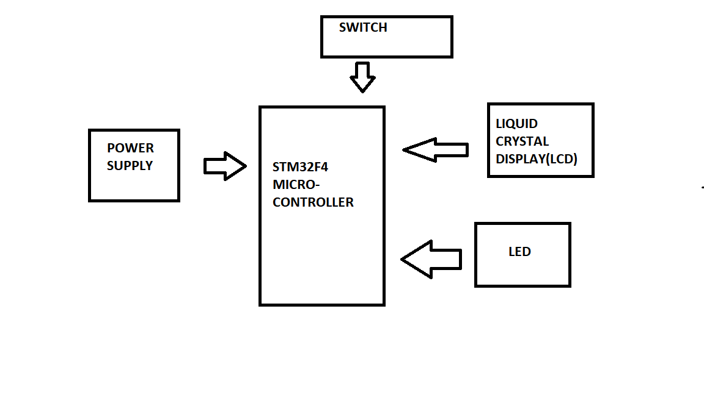

# The architecture of Car Wiper Control System
The Basic architecture of Car Wiper Control System based on the STM32 microconroller and corresponding three LED's they are RED,GREEN and Blue.

# Implementation Diagram

## The Architecture Of STM32 Microcontroller
Basically the STM32 Microcontroller designed with different components according to different consideration and requirements.

The STM32 Microcontroller designed with several components like Programming Connector,Display,GPS,Battery Level Monitor,USB,Switch and Several LED's.

The Architecture of STM32 Microcontroller with diagram is given by,

# The Block Diagram Of Car Wiper Control System
The block diaram of Car wiper control usig STM32F4 is shown Below,

# Pin Diagram Of STM32F4 Microcontroller

# Pin Assignment
The pin assignment of STM32F407 is given by,

## Push Button

# Design System

# Flow Chart

# State Diagram of Wiper Control System
The Car Wipers clean the front window or screen of car Based on the switch and different LED's.When Press Switch, the car wiper will start to clean front screen when there is water.Basically this system is developed on rainy situation to optimize or detect Accidents.Finall the wapers clean the water on front screen of a car.The state diagram of Car Wiper Control System is given by,

# The UML Diagram for Car Wiper Control System

# Behavioral Diagram For Car Wiper Control System
The behavioral diagram foe car wiper control system is given by,

# The Data Flow Diagram

